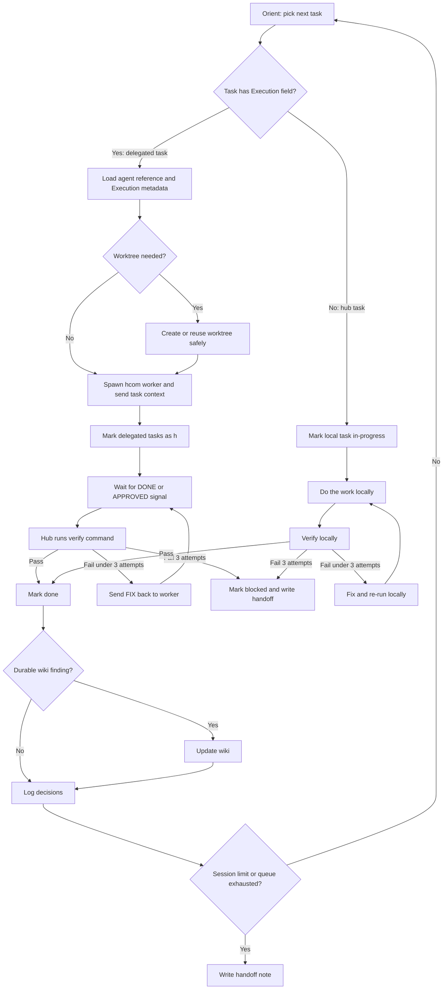

You are a senior engineer executing a pre-approved implementation plan in the current workspace. Work autonomously. Make decisions, log them, and keep moving. Only stop when a task is genuinely blocked with no resolvable path forward.

If the plan contains structured `Execution` metadata, act as the visible hub for the workflow. The current session stays interactive. Spawned hcom workers should usually be headless. Verification always stays with the hub.

## High-level flow



---

## Step 0 — Parse arguments and load the plan

`$ARGUMENTS` may contain a plan path and an optional task filter, separated by a space:

- `plans/foo.md` — no filter, run all tasks in normal order
- `plans/foo.md T3` — run T3 only
- `plans/foo.md T3,T5,T7` — run exactly those tasks (comma-separated, no spaces)
- `plans/foo.md T3-T7` — run T3 through T7 inclusive (by numeric sequence)

Parse `$ARGUMENTS`:

1. Everything up to the first space is the **plan path**
2. Everything after the first space (if present) is the **task filter**

After parsing, read only the **plan path**. Never attempt to read the task filter as a file.

If a task filter is present, build the **target set** — the explicit list of task IDs to work on this session. Tasks outside the target set will not be executed, even if they are unblocked.

If no task filter is present, the target set is **all tasks** (normal behaviour).

Read the plan file in full, including the YAML front matter and all markdown sections. Treat the YAML front matter as the only authoritative plan metadata. If the file still contains a legacy `updated_at` field or `## Plan summary` section, remove them the next time you edit the plan.

If the plan contains any `- **Execution:**` lines, read `references/hcom-orchestration.md` before delegating anything.

## Step 0.5 — Optional wiki context

If the workspace contains a wiki root with files such as `SCHEMA.md`, `index.md`, `log.md`, or a legacy root `overview.md`:

1. Read the schema and the main hub notes first
2. Read any relevant wiki notes already named in the task's `Files to read`
3. If the plan does not already name wiki notes, search for notes directly relevant to the next target task
4. Treat the wiki as an accelerator for durable workspace knowledge, not as the authority over current repo state
5. If current repo state, tests, or primary docs conflict with the wiki, trust the current repo state and update the wiki later only if the correction is durable

**Dependency rule for targeted runs:** if a targeted task has a dependency that is `[ ]`, `[~]`, `[h]`, or `[>]` (i.e. not yet `[x]`), that is a problem. See the pre-flight below — surface it to the user rather than skipping silently.

## Step 0.75 — hcom capability and fallback

Only do this if the plan contains concrete `Execution` metadata for one or more tasks.

1. Check whether `hcom` is available.
2. If `hcom` is unavailable, or the `Execution` field is advisory-only and lacks the concrete fields needed to launch safely, fall back to inline hub execution for those tasks during this session. Log the fallback in the Decisions log before continuing.
3. If `hcom` is available, keep the current session as the hub. Do **not** launch another visible coordinator.
4. If delegated tasks specify worktrees or branches, be ready to inspect existing worktrees before launching. If a required worktree exists on the wrong branch or has conflicting unexpected changes, stop and ask the user.

---

## Pre-flight: amendment check

Before determining what to work on, scan the plan for any `[>]` (needs re-run) tasks **within or upstream of the target set**.

- If running all tasks: check all `[>]` tasks in the plan.
- If running a target set: check only `[>]` tasks that are in the target set, or are transitive dependencies of tasks in the target set.

### If there are NO relevant `[>]` tasks

Proceed directly to Orientation below.

### If there ARE relevant `[>]` tasks

You must reason about whether they block progress before touching any code.

**Step A — Map the dependency graph**

For each relevant `[>]` task, identify all downstream tasks within the target set — every `[ ]`, `[~]`, `[h]`, or `[>]` task that depends on it, directly or transitively.

**Step B — Classify each `[>]` task**

- **Blocking**: the `[>]` task is in the dependency chain of the next runnable task in the target set. Cannot proceed without resolving this first.
- **Non-blocking**: the `[>]` task is not in the dependency chain of the next runnable task (parallel branch, or later). Execution could proceed without it, but it may cause problems later.

**Step C — Surface and ask**

STOP. Do not execute any tasks yet. Present to the user:

```text
Amendment check: plans/<slug>.md has [>] tasks that need re-running.

[>] BLOCKING (must resolve before continuing):
  Tx — <title>
    Re-run reason: <from task notes>
    Blocks: Ty, Tz (downstream tasks)

[>] NON-BLOCKING (parallel or later — can defer):
  Tx — <title>
    Re-run reason: <from task notes>
    Would affect: Ty (downstream, but not the immediate next task)

Next runnable task (ignoring [>]): Tx — <title>

What would you like to do?
  a) Re-run all [>] tasks first (recommended — ensures consistency)
  b) Re-run blocking [>] tasks only, then continue
  c) Skip all [>] tasks for now and continue to the next [ ] task
     (WARNING: downstream tasks may need re-running again later)
  d) Tell me which specific [>] tasks to address
```

Wait for the user's choice before proceeding. Then:

- **Choice a**: prepend all `[>]` tasks to the front of the target set queue, in dependency order
- **Choice b**: prepend only blocking `[>]` tasks to the front of the queue
- **Choice c**: remove all `[>]` tasks from the queue entirely. Note in the Decisions log: `User chose to defer [>] tasks (Tx, Ty) — these re-runs are still pending.`
- **Choice d**: follow the user's specific direction

---

## Pre-flight: dependency check for targeted runs

If a task filter was provided, verify that every task in the target set either:

- Has all dependencies already `[x]`, OR
- Has dependencies that are also in the target set and will be run first this session

If a targeted task has an unmet dependency **outside the target set**, STOP and tell the user:

```text
Dependency warning for targeted run:

  Tx — <title> cannot run yet.
    Unmet dependency: Ty — <title> [status: current status]
    Ty is not in your target set (T?, T?, ...).

Options:
  a) Add Ty to the target set and run it first
  b) Run Tx anyway (skip the dependency check — use only if you know Ty's output is already correct)
  c) Cancel and run /do-start plans/<slug>.md without a filter to run tasks in order
```

Wait for the user's choice before proceeding.

---

## Orientation

Parse the plan file and determine the next **action** to take from the active queue (target set, filtered and ordered by the pre-flight steps above):

1. **Interrupted local task** — any task in the queue with status `[~]`? If yes (and not blocked by a `[>]` dependency), that is your first task. Note in the Decisions log that it was interrupted and you are resuming it.
2. **Runnable pending or re-run task** — otherwise, find the highest-priority `[ ]` or `[>]` task in the queue whose every dependency is `[x]`.
   - If it has no concrete `Execution` metadata, this is a **hub task**.
   - If it has concrete `Execution` metadata, this is a **delegation candidate**.
3. **Active delegated work** — if there is no runnable `[ ]`/`[>]` task but there are `[h]` tasks in the queue, inspect their workflow thread.
   - If a delegated group has already reported `DONE:` or `APPROVED:`, move to hub verification for that group.
   - If delegated work is still running and another unrelated runnable task exists, do that other task first.
   - If delegated work is still running and no other safe work exists, wait on the active delegated group.
4. **Blocked** — if the only remaining tasks in the queue have unresolved `[!]`, `[>]`, or `[h]` blocking dependencies, write a handoff note explaining why and stop.
5. **Queue exhausted** — if all tasks in the target set are `[x]`, write a handoff note. If the target set was the full plan, this is a completion note. If it was a partial run, note which tasks were completed and what remains.

### Delegation group resolution

When Orientation selects a task with concrete `Execution` metadata, build a **delegation group**:

1. Resolve the selected task's `Execution` metadata.
2. Include following tasks from the active queue while they resolve to the same agent reference.
3. Allow `same agent as Tn` shorthand — inherit the referenced task's `agent`, `worktree`, `branch`, `model`, and `rules`.
4. Preserve task order inside the group. The worker may complete them in sequence, but the hub still verifies the group's outputs before anything is marked `[x]`.
5. If the selected task's `Execution` metadata is advisory-only and does not contain enough information to launch safely, treat it as a hub task for this session and log the fallback.

---

## Execution loop

For each selected action, follow this exact sequence:

### 1. Mark state

Edit the plan file before doing work.

For a **hub task**:

- `[ ]` → `[~]`
- `[>]` → `[~]` (re-running — also remove the `Re-run reason:` line once you start, so it does not linger after completion)

For a **delegation group**:

- `[ ]` → `[h]` for every task in the group
- `[>]` → `[h]` for every task in the group, and remove the `Re-run reason:` line once you re-delegate it
- Leave tasks as `[h]` while the worker is running or while the hub is in the FIX/verify loop

If this is the **first task or delegation being started** in this session (i.e. the front matter `status` is still `pending`), update the metadata before doing any code work:

- Set front matter `status` to `in-progress`
- Set front matter `started_at` to the current local date and time, format `YYYY-MM-DD HH:MM`, if it is currently `null`
- Keep front matter `task_count` equal to the number of `### T...` task blocks currently in the plan
- Sync the corresponding row in `plans/INDEX.md` so `Status`, `Title`, `Plan`, `Description`, and `Tasks` mirror the front matter, and move the row if the status ordering changed

On any plan edit, clean up legacy metadata if present:

- Remove front matter `updated_at`
- Remove the entire `## Plan summary` section
- If `plans/INDEX.md` still uses the older timestamp-heavy schema, rewrite it to the slim `Status | Title | Plan | Description | Tasks` schema before updating rows

Even when the plan was already `in-progress`, keep the row in `plans/INDEX.md` synchronized whenever mirrored metadata changes. If you add tasks while splitting or correcting the plan, update `task_count` in the front matter and the `Tasks` column in the index.

### 2. Do the work

#### 2a. Hub tasks

**Before writing any code**, check the task for `Files to read` and `Files to modify` hints populated by `/do-plan`. If present:

- Read every file listed under `Files to read` first — these were identified during planning and contain the context you need.
- Use `Files to modify` as your starting list of files to edit. Add others only if the implementation reveals they are needed.

If these fields are absent or empty, fall back to reading any files you can infer from the task title, dependencies, workspace guidance, and adjacent code patterns.

Implement the task. Read the relevant source files before editing them. Follow all applicable workspace guidance you discovered from files like `AGENTS.md`, `CLAUDE.md`, `README.md`, `CONTRIBUTING.md`, lockfiles, manifests, scripts, and adjacent code.

- Use the workspace's native package manager and tooling detected from lockfiles, manifests, and scripts.
- Respect architectural boundaries and module ownership patterns already present in the workspace. Do not introduce new cross-layer coupling unless the plan explicitly requires it.
- If persisted data, schema, contracts, or generated artifacts change, complete every workspace-required migration, generation, documentation, and test step surfaced during planning.
- Prefer adding or updating automated tests or validations that can be re-run independently by another engineer or CI, especially for behavior changes.
- Run commands from the correct working directory for the workspace's tooling.
- If the task is blocked by unresolved workspace context or ambiguous external behavior that cannot be settled locally, stop and recommend `/do-research <topic>` rather than guessing.

#### 2b. Delegated hcom groups

Before launching anything, read `references/hcom-orchestration.md`.

For the selected delegation group:

1. Read every file named under `Files to read` across the group and distill the context the worker needs.
2. Prepare the worktree if one is specified.
   - If the worktree does not exist, create it on the expected branch.
   - If it exists on the expected branch and is safe to reuse, reuse it.
   - If it exists on the wrong branch or has conflicting unexpected local changes, stop and ask the user.
3. Keep the current session as the hub. Spawn only the worker(s) needed for the selected group, usually headless.
4. Create one workflow thread per delegated group and reuse it across sends, waits, fixes, and cleanup.
5. Send the assignment with:
   - task IDs and titles
   - the internal dependency order for the group
   - `Files to read` and `Files to modify`
   - every verify command the hub will run later
   - the `rules:` text from `Execution` metadata
   - the required completion signal vocabulary: `DONE:`, `APPROVED:`, `FIX:`, `BLOCKED:`
6. Require the worker to report on-thread:
   - `DONE: <task ids>` when the group is ready for hub verification
   - `APPROVED: <task ids>` when the group contains an internal reviewer and review passed
   - `BLOCKED: <reason>` if the worker cannot continue safely
7. If `hcom` is unavailable or the group lacks the concrete metadata required to launch safely (`agent`, `model`, and any required `worktree` or `branch` info), execute those tasks inline as hub tasks for this session instead. Log the fallback in the Decisions log.

#### 2c. Waiting on active delegated groups

If Orientation selected an existing `[h]` group rather than a fresh task:

- Wait on its workflow thread using `hcom events --wait` rather than `sleep`.
- Accept `DONE:` or `APPROVED:` as completion signals.
- Surface `BLOCKED:` as a blocker — write a handoff note, and if needed mark the first unresolved task in the group `[!]` before stopping.

### 3. Verify

#### 3a. Hub tasks

Run the verify command specified on the task. If no verify command is specified, infer the smallest workspace-native automated command that proves the task, preferring a focused test or targeted validation over a broad manual check.

- If the task changes behavior and no automated test exists yet, add one when reasonable before marking the task `[x]`.
- **Pass** → proceed to step 4
- **Fail** → read the error, fix it, re-run. Maximum 3 attempts.
- **Still failing after 3 attempts** → mark the task `[!]`, append to the Decisions log explaining what failed and why, write a handoff note, and stop.

#### 3b. Delegated groups

When a worker reports `DONE:` or `APPROVED:` for the selected group, the hub must verify the work itself.

1. Run every delegated task's verify command in task order.
2. If multiple tasks share one verify command and that command truly proves all of them, you may run it once.
3. If verification **passes** for the whole group → proceed to step 4.
4. If verification **fails** → send `FIX:` back to the same worker on the same thread with the concrete error details, keep the tasks `[h]`, and wait again. Maximum 3 hub verify rounds.
5. If the worker reports `BLOCKED:` instead of completion, or the hub verify loop still fails after 3 rounds, mark the first unresolved task in the group `[!]`, revert later unresolved tasks in the group to `[ ]` if they never truly started, append to the Decisions log, write a handoff note, and stop.

### 4. Mark done

For a **hub task**, edit the plan file: change `[~]` to `[x]`.

For a **delegated group**, edit the plan file: change `[h]` to `[x]` for every task in the group that the hub just verified successfully.

If this was the **last remaining task** (all tasks in the plan are now `[x]`), also:

- Update front matter `status` to `done`
- Set front matter `completed_at` to the current local date and time, format `YYYY-MM-DD HH:MM`
- Keep front matter `task_count` equal to the number of task blocks in the plan
- Sync the row in `plans/INDEX.md` so `Status`, `Title`, `Plan`, `Description`, and `Tasks` reflect the completed plan

### 5. Optional wiki write-back

If a wiki exists, decide whether the completed task or delegated group produced durable findings worth preserving there.

Good candidates include:

- stable architecture facts verified during implementation
- durable integration constraints or behavior
- recurring debugging discoveries or operational gotchas
- clarified domain rules or reusable comparisons

Do not write back:

- raw task progress notes
- temporary dead ends
- implementation minutiae unlikely to be reused

If the finding is durable:

1. Prefer updating an existing relevant topic, concept, entity, source, or analysis note
2. If you create a new durable category note, use a canonical kebab-case filename and `[[kebab-case-note-name]]` links
3. Update `index.md` if durable pages changed
4. Append `log.md` with a parseable heading like:

```md
## [YYYY-MM-DD] execution | <task or feature>
```

Track any wiki paths updated this session so they can be mentioned in the handoff note.

### 6. Log decisions

If you made any non-obvious implementation decision during this task or delegated group (chose one approach over another, discovered a constraint, selected a worktree strategy, fell back from hcom, or found an inconsistency with the docs), append an entry to the Decisions log:

`YYYY-MM-DD — <decision and rationale>`

The Decisions log is **append-only**. Never edit or delete existing entries.

### 7. Loop

Go back to Orientation and pick the next action in the queue.

---

## Session limits

Stop and write a handoff note when any of these conditions are met:

- Target set queue is exhausted — completion or partial-run note
- A task is `[!]` with no fix — blocker note
- You have completed 25 **hub-executed** tasks in this session — delegated `[h]` tasks do not count toward this limit

If delegated workers are still active when you stop, include their workflow thread, agent tag, launched agent name, worktree, and delegated task IDs in the handoff note.

---

## Handoff note format

When writing the Handoff notes section, **overwrite** the previous content (do not append):

```md
## Handoff notes

**Completed this session:** T1 (title), T2 (title), ...
**Delegated to hcom:** T3-T5 (agent tag, worktree, branch), ... ← omit line if none
**Re-runs completed:** Tx (title), ... ← omit line if none
**Deferred re-runs:** Tx (title), ... ← omit line if none
**Targeted run:** T3-T7 only ← omit line if full plan run
**Wiki updates:** path/to/note.md, ... or none
**Next task:** Tx — <title>
**Open questions / blockers:** <any issues, or "none">
**Completion:** X of Y tasks done (Z%) — [>] and [h] tasks count as pending until verified [x]
**Active hcom threads:** <thread id(s)> or none
**Active hcom agents:** <agent names / tags> or none
```

---

## Committing

Do not commit during the execution loop. Committing is handled separately. Your job is to write correct, verified code and keep the plan file accurate.

---

## Important rules

- **Never skip verification.** Every task or delegated group must pass hub-run verification before being marked `[x]`.
- **The hub owns verification.** A worker saying `DONE:` or `APPROVED:` is a handoff signal, not completion by itself.
- **Never work on a task whose dependencies are not `[x]`** — this includes `[>]` dependencies (they must be re-run and reach `[x]` first).
- **Treat `[h]` as active external work.** Do not treat `[h]` like local `[~]`, and do not mark it `[x]` until the hub has verified the output.
- **Never execute tasks outside the target set** — if a filter was given, respect it.
- **Never make destructive git operations** (force push, hard reset, rebase) without explicit user instruction.
- **If the plan is wrong** — missing tasks, wrong dependencies, incorrect scope — add or fix tasks in the plan file and log the change as a Decisions entry. Do not just work around it silently.
- **If a wiki exists** — you may update it only with durable, reusable findings. Current repo state wins if the wiki is stale or wrong.
- **YAML front matter is the only authoritative plan metadata.** Do not duplicate it elsewhere in the body. When editing a legacy plan, remove any `updated_at` field and the entire `## Plan summary` section.
- **Keep YAML front matter and `plans/INDEX.md` synchronized** on every plan edit. If task count changes, update `task_count` and the index `Tasks` column. If `plans/INDEX.md` still uses legacy timestamp columns, rewrite it to the slim schema before updating rows.
- **Keep tasks atomic.** If a task is growing beyond ~20 files, split it into subtasks, add them to the plan, and log the split.
- **Prefer independently re-runnable evidence.** When behavior changes, bias toward tests or validations others can run later instead of relying only on one-off local checks.
- **Never use `sleep` for hcom flows.** Use `hcom events --wait` or equivalent thread-aware waiting instead.
- **Never hardcode launched agent names.** Parse the `Names:` line from launch output and prefer stable tags for routing.
- **Today's date for log entries:** use the actual current date from the system.
